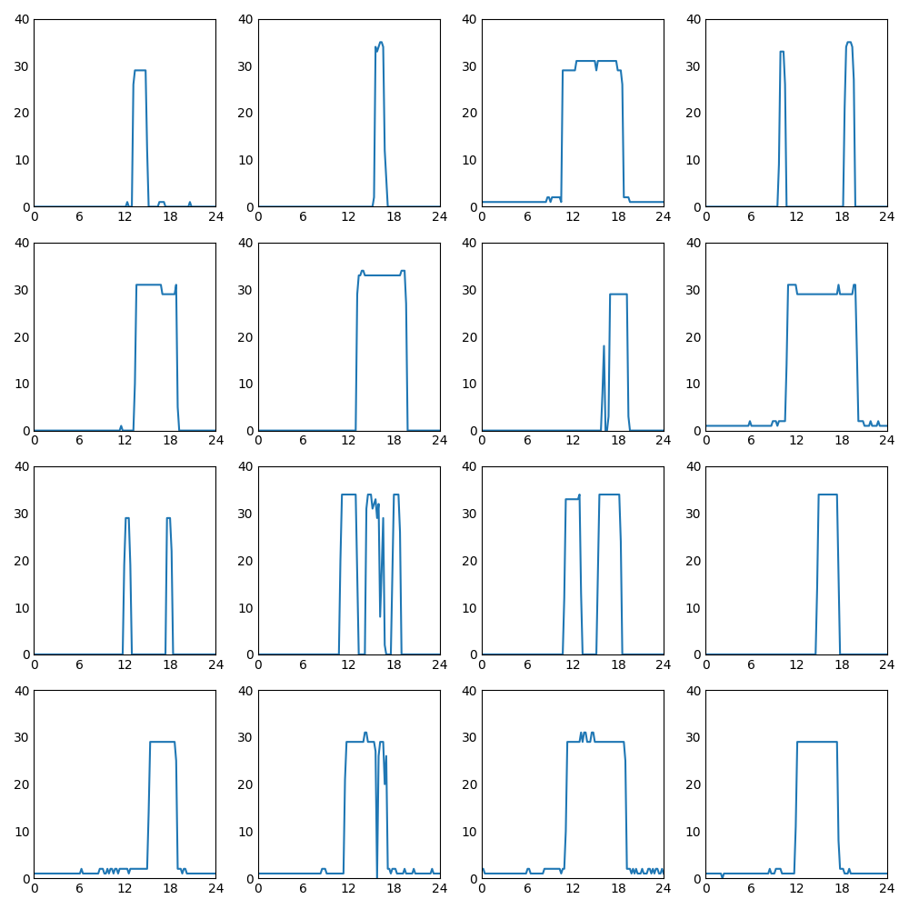
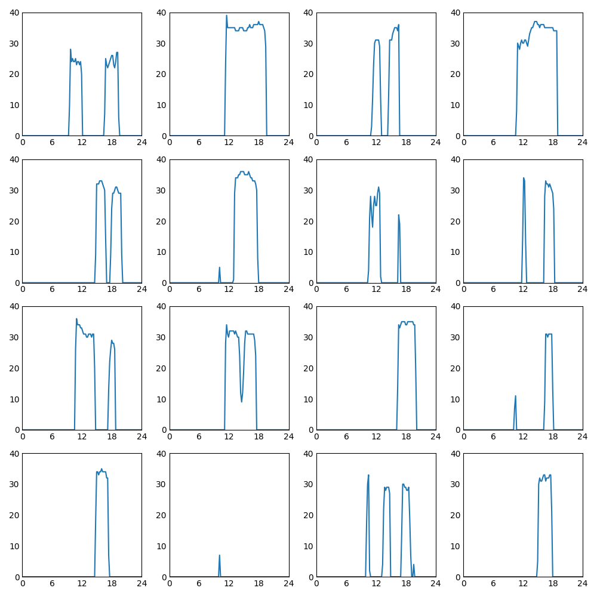

# WaveGenerator

人工的な波形をGANで作成してみるテスト

# Abstract

1日の電力使用量の時系列データが120次元で存在する．


この波形に似たものを，Generatorで生成することができるかという問題を扱う．瞬間的にレベルが上昇し，そのレベルを一定時間維持した後レベルが落ちるようなグラフである．（横スライドと呼称している）．

5000イテレーション学習させたジェネレータで出力させると，以下のようになる．



## Environments

* python3
* keras
* matplotlib
* pandas
* tqdm
* numpy
* tensorflow

## Run

```
$ python3 visualize.py
$ python3 main_noise.py --train --test
```

## Data

1. Remove ZERO data
2. Normalize
3. Outlier

詳細はmain_noise.pyのX_train_generate()

## 比較

|         | ZERO | Outlier | Normalize ||Result|
|----     |----- |----     |----       |----|----|
|A        | ○    |         |           ||aaa|
|B        | ○    | ○       |           ||aaa|
|C        | ○    | ○       | ○         ||aaa|

## 今後の課題

1. 完全な”横スライド”を獲得するモデルを探索する
2. DeconvとUpsampling->Convの違いを確認する
3. 正規化の有る無しで把握する．
